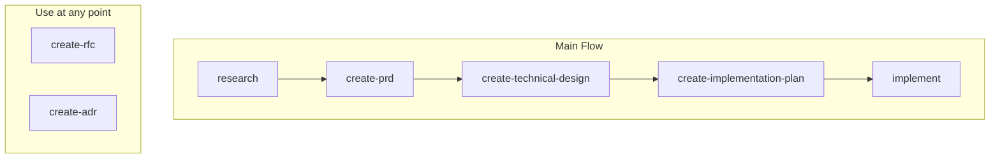
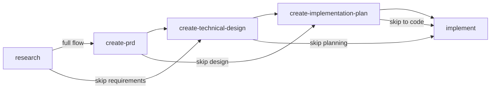

# Agent Skills

A collection of reusable agent skills, tools, and workflows designed to extend LLM capabilities and enable autonomous task execution.

## Installation

Skills are installed using the [`skills` CLI](https://github.com/vercel-labs/skills).

**Install all skills:**

```bash
npx skills add emiliosheinz/agent-skills
```

**Install a single skill:**

```bash
npx skills add emiliosheinz/agent-skills --skill <skill-name>
```

By default, skills are installed locally to the current project. Use `--global` to install them to your user directory instead, making them available across all projects.

```bash
# Local (current project only)
npx skills add emiliosheinz/agent-skills

# Global (all projects)
npx skills add emiliosheinz/agent-skills --global
```

## Available Skills

| Skill | Description |
|-------|-------------|
| <nobr>`create-adr`</nobr> | Creates Architecture Decision Records (ADRs) to document architectural choices and their rationale. Use when asked to create or write an ADR, document a decision, record why something was chosen, or capture an architectural decision. |
| <nobr>`create-implementation-plan`</nobr> | Creates implementation plans covering phases, tasks, sequencing, dependencies, milestones, and risks. Use when asked to create an implementation plan, plan an execution, break work into phases, or describe how to build something step by step. |
| <nobr>`create-prd`</nobr> | Creates structured, explicit, and detailed Product Requirement Documents (PRDs). Use when asked to create or write a PRD, define product requirements, specify what to build, or capture requirements before implementation begins. |
| <nobr>`create-rfc`</nobr> | Creates structured Request for Comments (RFC) documents for proposing and deciding on significant changes. Use when asked to create or write an RFC, draft a proposal, align stakeholders, or propose a change before a decision. |
| <nobr>`create-technical-design`</nobr> | Creates technical design documents covering architecture, component responsibilities, data models, API contracts, and key decisions. Use when asked for a technical design, architecture document, system design, technical spec, or design doc. |
| <nobr>`implement`</nobr> | Executes implementation by consuming existing PRD, technical design, and implementation plan artifacts. Use when asked to implement a feature, build something, start implementing, write the code, or execute an existing plan. |
| <nobr>`investigate`</nobr> | Guides the agent through a five-phase debugging workflow to diagnose and fix issues. Use when reporting a bug, error, crash, broken or unexpected behavior, exception, failing test, or anything that is not working as expected. |
| <nobr>`research`</nobr> | Deeply explores a problem space before any spec or design work begins. Use when asked to research a topic, explore or understand a problem space, or gather context before writing requirements or designing a solution. |

## Document Workflow

Skills map to different stages of the decision-to-implementation pipeline. Every skill can be used standalone — when upstream artifacts are missing, it performs a quick research phase to derive the context it needs.

### Full pipeline



RFC and ADR are not tied to any specific stage — use them whenever a significant decision needs alignment or recording.

### Flexible entry points

You do not have to start at the beginning. Jump in at whichever stage fits the task:



| Stage | Skill | Question It Answers | Upstream Input |
|-------|-------|---------------------|----------------|
| Research | `research` | What is the problem, who is affected, and what do we know? | None — gathered via interview, codebase scan, and web research |
| Requirements | `create-prd` | What are we building, for whom, and why? | RESEARCH (optional) |
| Decision | `create-rfc` | Should we do X or Y? Which approach? | PRD (optional) |
| Record | `create-adr` | Why did we choose X over Y? | RFC outcome (optional) |
| Design | `create-technical-design` | What is the architecture, data model, and API contract? | RESEARCH and/or PRD if available, otherwise gathers directly |
| Plan | `create-implementation-plan` | How do we execute the work in phases? | Technical design or PRD if available, otherwise researches codebase |
| Build | `implement` | Turn the plan into tested, working code | Any combination of above, or derives from codebase |

### Common combinations

> `create-rfc` and `create-adr` can be invoked at any point when a significant decision needs to be proposed or recorded. They are not required for the main flow but are available whenever needed.

- **Full process**: `research` → `create-prd` → `create-technical-design` → `create-implementation-plan` → `implement`
- **Known problem, no prior research**: `create-prd` → `create-technical-design` → `create-implementation-plan` → `implement`
- **Technical task, no product work**: `create-technical-design` → `create-implementation-plan` → `implement`
- **Simple feature**: `create-implementation-plan` → `implement`
- **Straightforward task**: `implement` directly
