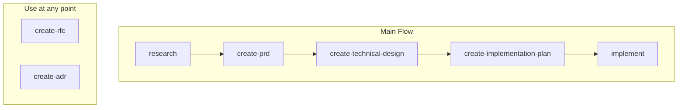
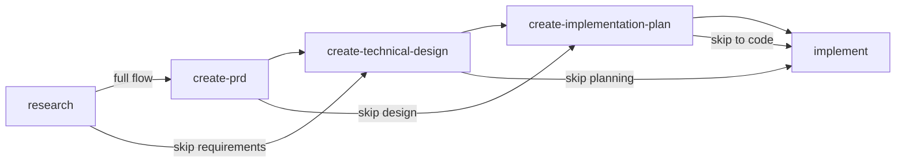

# Agent Skills

A collection of reusable agent skills, tools, and workflows designed to extend LLM capabilities and enable autonomous task execution.

## Installation

Skills are installed using the [`skills` CLI](https://github.com/vercel-labs/skills).

**Install all skills:**

```bash
npx skills add emiliosheinz/agent-skills
```

**Install a single skill:**

```bash
npx skills add emiliosheinz/agent-skills --skill <skill-name>
```

By default, skills are installed locally to the current project. Use `--global` to install them to your user directory instead, making them available across all projects.

```bash
# Local (current project only)
npx skills add emiliosheinz/agent-skills

# Global (all projects)
npx skills add emiliosheinz/agent-skills --global
```

## Available Skills

| Skill | Description |
|-------|-------------|
| <nobr>`create-adr`</nobr> | Creates Architecture Decision Records (ADRs) to document significant architectural choices and their rationale for future team members. Saves the record to .specs/decisions/[slug].md following project conventions. |
| <nobr>`create-implementation-plan`</nobr> | Creates implementation plans covering phases, tasks, sequencing, dependencies, milestones, and risks. Consumes a technical design document when one exists and breaks the work into executable, vertically-sliced phases. |
| <nobr>`create-prd`</nobr> | Creates structured, explicit, and detailed Product Requirement Documents (PRDs). Captures problem statement, target users, success criteria, scope, and functional requirements before implementation begins. |
| <nobr>`create-rfc`</nobr> | Creates structured Request for Comments (RFC) documents for proposing and deciding on significant changes. Drives stakeholder alignment before a major technical or process decision is made. |
| <nobr>`create-technical-design`</nobr> | Creates technical design documents covering architecture, component responsibilities, data models, API contracts, trade-offs, and key decisions. Defines what to build and how it is structured — not how to execute the work. |
| <nobr>`implement`</nobr> | Executes implementation by consuming existing PRD, technical design, and implementation plan artifacts. Turns requirements and design documents into working, tested code using TDD (Red-Green-Refactor). |
| <nobr>`investigate`</nobr> | Guides the agent through a five-phase debugging workflow: structured intake, evidence investigation, ranked hypothesis generation, test-case reproduction, and a concrete fix proposal with prevention measures. Saves the final report to .specs/bugs/[bug-name].md following project conventions. |
| <nobr>`research`</nobr> | Deeply explores a problem space — interviewing the user, scanning the codebase, and researching external references — before any spec or design work begins. Produces a structured RESEARCH.md artifact consumed by create-prd and create-technical-design. |

## Document Workflow

Skills map to different stages of the decision-to-implementation pipeline. Every skill can be used standalone — when upstream artifacts are missing, it performs a quick research phase to derive the context it needs.

### Full pipeline



RFC and ADR are not tied to any specific stage — use them whenever a significant decision needs alignment or recording.

### Flexible entry points

You do not have to start at the beginning. Jump in at whichever stage fits the task:



| Stage | Skill | Question It Answers | Upstream Input |
|-------|-------|---------------------|----------------|
| Research | `research` | What is the problem, who is affected, and what do we know? | None — gathered via interview, codebase scan, and web research |
| Requirements | `create-prd` | What are we building, for whom, and why? | RESEARCH (optional) |
| Decision | `create-rfc` | Should we do X or Y? Which approach? | PRD (optional) |
| Record | `create-adr` | Why did we choose X over Y? | RFC outcome (optional) |
| Design | `create-technical-design` | What is the architecture, data model, and API contract? | RESEARCH and/or PRD if available, otherwise gathers directly |
| Plan | `create-implementation-plan` | How do we execute the work in phases? | Technical design or PRD if available, otherwise researches codebase |
| Build | `implement` | Turn the plan into tested, working code | Any combination of above, or derives from codebase |

### Common combinations

> `create-rfc` and `create-adr` can be invoked at any point when a significant decision needs to be proposed or recorded. They are not required for the main flow but are available whenever needed.

- **Full process**: `research` → `create-prd` → `create-technical-design` → `create-implementation-plan` → `implement`
- **Known problem, no prior research**: `create-prd` → `create-technical-design` → `create-implementation-plan` → `implement`
- **Technical task, no product work**: `create-technical-design` → `create-implementation-plan` → `implement`
- **Simple feature**: `create-implementation-plan` → `implement`
- **Straightforward task**: `implement` directly
