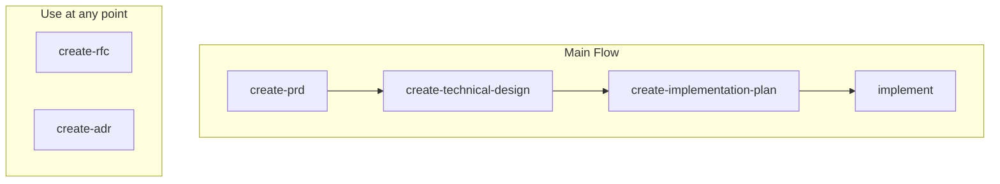
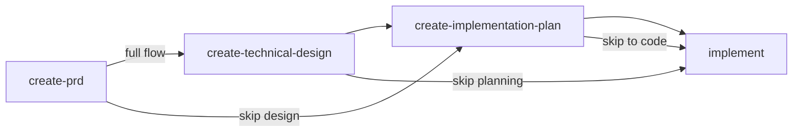

# Agent Skills

A collection of reusable agent skills, tools, and workflows designed to extend LLM capabilities and enable autonomous task execution.

## Installation

Skills are installed using the [`skills` CLI](https://github.com/vercel-labs/skills).

**Install all skills:**

```bash
npx skills add emiliosheinz/agent-skills
```

**Install a single skill:**

```bash
npx skills add emiliosheinz/agent-skills --skill <skill-name>
```

By default, skills are installed locally to the current project. Use `--global` to install them to your user directory instead, making them available across all projects.

```bash
# Local (current project only)
npx skills add emiliosheinz/agent-skills

# Global (all projects)
npx skills add emiliosheinz/agent-skills --global
```

## Available Skills

| Skill | Description |
|-------|-------------|
| <nobr>`create-adr`</nobr> | Creates Architecture Decision Records (ADRs) to document significant architectural choices and their rationale for future team members. Use when the user says "create an ADR", "write an ADR", "create an ADR for X", "document a decision", "record why we chose X", or wants to capture the reasoning behind a technical choice so the team understands it later. Do NOT use for technical design, implementation plan, RFC, or PRD docs. |
| <nobr>`create-implementation-plan`</nobr> | Creates implementation plans covering phases, tasks, sequencing, dependencies, milestones, and risks. Use when the user says "create an implementation plan", "implementation plan", "execution plan", "plan the implementation of X", "how do we build X step by step", or "break this into phases". Can consume a technical design document as input. Do NOT use for architecture, system design, PRD, RFC, or ADR. |
| <nobr>`create-prd`</nobr> | Creates structured, explicit, and detailed Product Requirement Documents (PRDs). Use when the user says "create a PRD", "write a PRD", "create a PRD for X", "define the requirements for X", "write product requirements", or wants to plan what to build before implementation begins. Do NOT use for technical design, implementation plan, RFC, or ADR docs. |
| <nobr>`create-rfc`</nobr> | Creates structured Request for Comments (RFC) documents for proposing and deciding on significant changes. Use when the user says "create an RFC", "write an RFC", "create an RFC for X", "create a proposal", "draft an RFC", or needs stakeholder alignment before making a major technical or process decision. Do NOT use for technical design, implementation plan, PRD, or ADR docs. |
| <nobr>`create-technical-design`</nobr> | Creates technical design documents covering architecture, system design, component responsibilities, data models, API contracts, trade-offs, and key decisions. Use when the user says "create a technical design", "write a technical design", "architecture document", "system design", "technical spec", or "design doc". Outputs architectural decisions only — no step-by-step implementation. Do NOT use for PRD, RFC, ADR, or implementation plans. |
| <nobr>`implement`</nobr> | Executes implementation by consuming existing PRD, technical design, and implementation plan artifacts. Use when the user says "implement this", "implement phase N", "build this feature", "start implementing", "execute the plan", or wants to turn requirements and design documents into working code using TDD (Red-Green-Refactor). Do NOT use for creating PRDs, technical designs, implementation plans, RFCs, or ADRs. |

## Document Workflow

Skills map to different stages of the decision-to-implementation pipeline. Every skill can be used standalone — when upstream artifacts are missing, it performs a quick research phase to derive the context it needs.

### Full pipeline



RFC and ADR are not tied to any specific stage — use them whenever a significant decision needs alignment or recording.

### Flexible entry points

You do not have to start at the beginning. Jump in at whichever stage fits the task:



| Stage | Skill | Question It Answers | Upstream Input |
|-------|-------|---------------------|----------------|
| Requirements | `create-prd` | What are we building, for whom, and why? | None — gathered via interview |
| Decision | `create-rfc` | Should we do X or Y? Which approach? | PRD (optional) |
| Record | `create-adr` | Why did we choose X over Y? | RFC outcome (optional) |
| Design | `create-technical-design` | What is the architecture, data model, and API contract? | PRD if available, otherwise gathers directly |
| Plan | `create-implementation-plan` | How do we execute the work in phases? | Technical design or PRD if available, otherwise researches codebase |
| Build | `implement` | Turn the plan into tested, working code | Any combination of above, or derives from codebase |

### Common combinations

> `create-rfc` and `create-adr` can be invoked at any point when a significant decision needs to be proposed or recorded. They are not required for the main flow but are available whenever needed.

- **Full process**: `create-prd` → `create-technical-design` → `create-implementation-plan` → `implement`
- **Technical task, no product work**: `create-technical-design` → `create-implementation-plan` → `implement`
- **Simple feature**: `create-implementation-plan` → `implement`
- **Straightforward task**: `implement` directly
